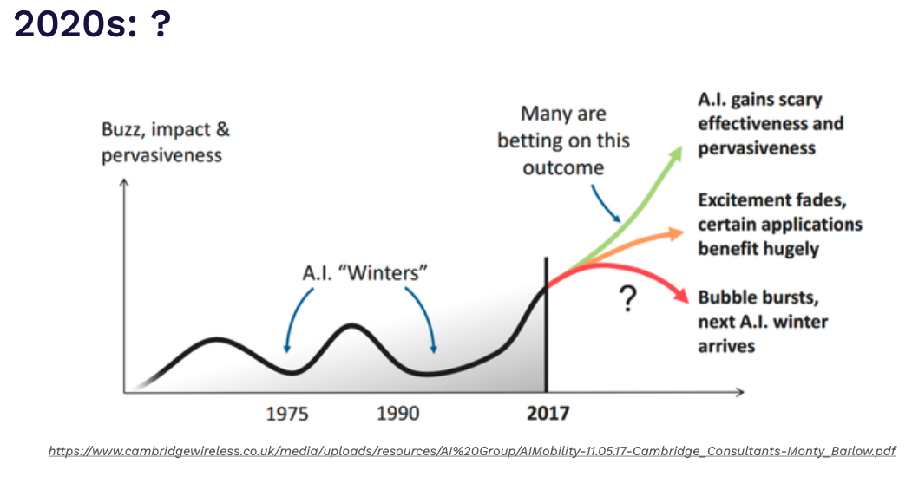
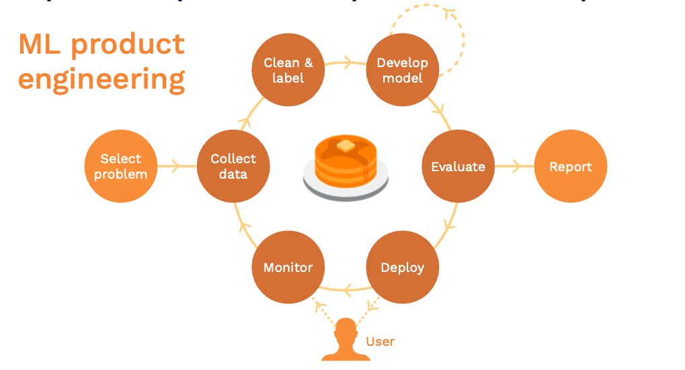
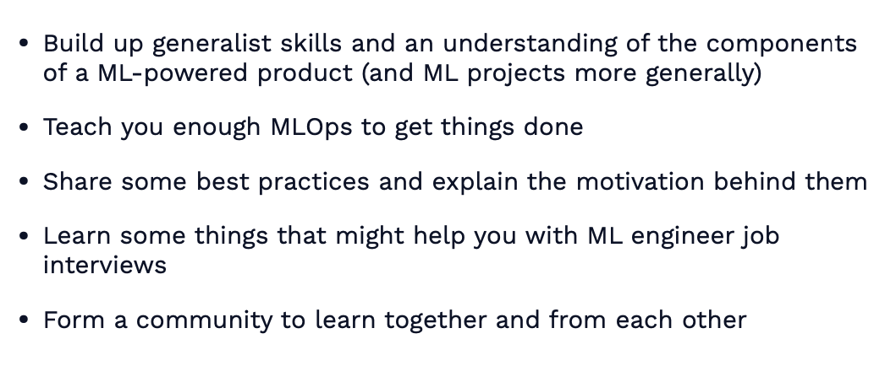
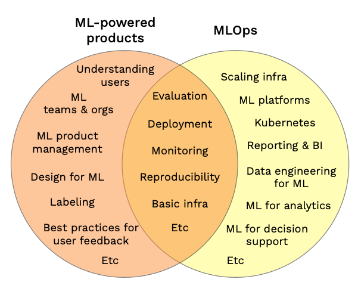
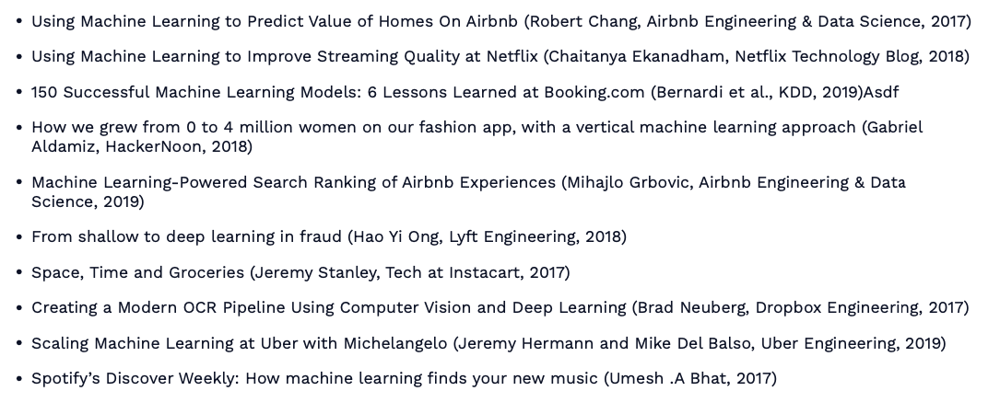
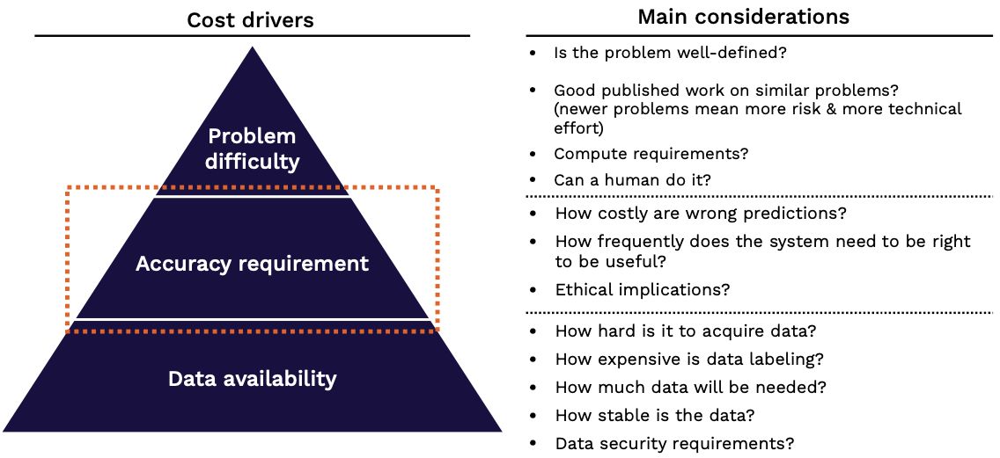
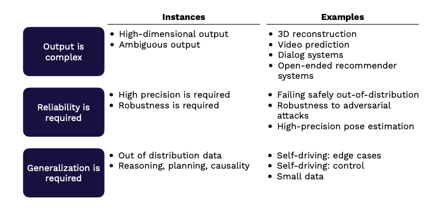
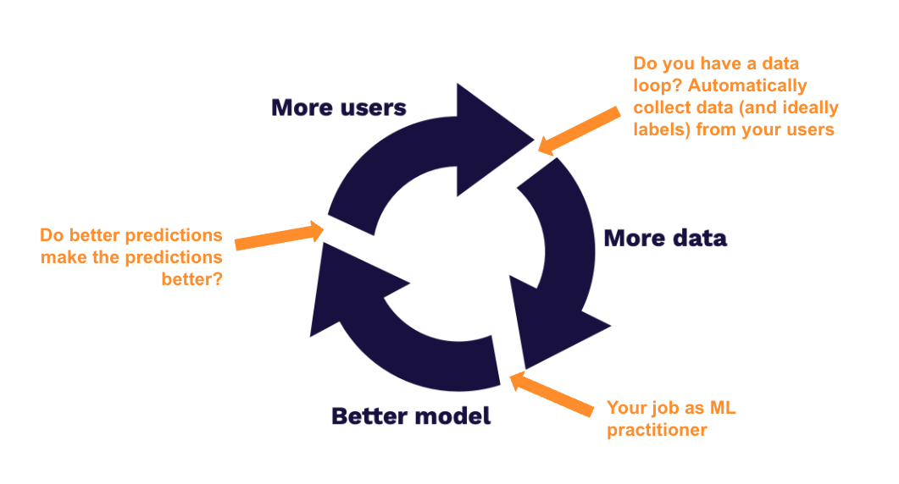
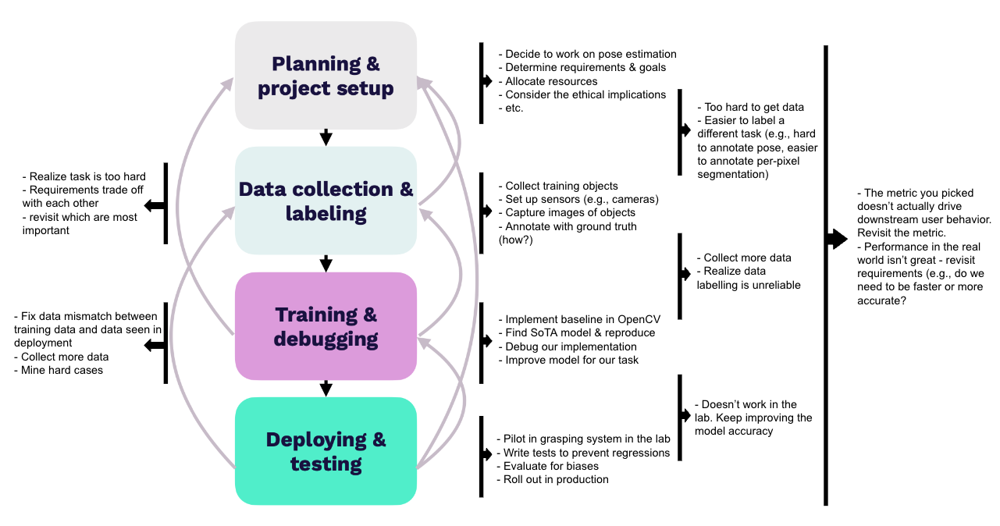

# Lecture 1: Introduction to the course

## Agenda
- **Course Vision**: Why ML-powered products
- **When to use ML**: Should we use ML?
- **Lifecycle**: What are the stages of a ML-project

## Course Vision

- This is a course (and community) for **people building ML-powered products**
#### ML is becoming a *"mainstream technology"* 
- with a lot of startups and funding being pumped into them
- In 2018, it was mostly big companies. Now, there are smaller companies with powerful and impactful products. Thus, lot more opportunities.
- Currently, the biggest impact is **commoditization of model training** with
  - model as service
  - Lot of code standardization. Therefore, ease of engineering with model as service
  - Many a times, it is about figuring out what model to use and fine-tune to your need

#### Future of AI at this point

> _**An AI winter can be avoided by translating research progress to real-world products and commercializing it**_

#### ML-powered products engineering
- These products require an outer loop in the form of monitoring and deployment (`NO-FLAT EARTH approach is applicable`)

#### Course Goals

- **However, this course is not about**
  - Learning ML from scratch
  - Whole breath of deep learning techniques
  - Research in DL
  - Full spectrum of MLOps
- In order to refresh the pre-requisites, refer to:
  - [Andrew Ng's ML collection](https://www.coursera.org/collections/machine-learning)
  - [Google ML](https://developers.google.com/machine-learning/crash-course)
  - [The missing semester](https://missing.csail.mit.edu/)

#### ML-powered products vs MLOps
- MLOps is more about ML infrastructure, scaling and platform

## When to use ML
#### Why ML projects fail?
- ML is still research - one should not aim for 100% success
- Technically infeasible or poorly scoped
- Never make the leap to prod 
- Unclear success criteria
- Works, but doesn’t solve a big enough problem to be worth the complexity
> Always remember
> _**Value of ML-project >> Complexity introduced in the software + cost of development**_

#### ML introduces a lot of complexity
- Erodes the boundaries between systems
- Relies on expensive data dependencies
- Commonly plagued by system design anti-patterns
- Subject to the instability of the external world

- Good paper to read: [Machine Learning: The High Interest Credit Card of Technical Debt](https://research.google/pubs/pub43146/)

#### Questions to ask before starting an ML project
- **Do we have a product?**
  - Do we really need ML to solve this problem?
  - Are we ready to use ML?
  - Are we collecting data and storing it in a sane way?
  - Do we have the right people?
- **Do we really need ML to solve this problem?** 
- **Is it ethical?**

#### How to pick problems to solve with ML?
- Look for **high-impact, low-cost problems** first
- **High-impact problems address**:
    - Friction in your product
    - Complex parts of your pipeline
    - Places where cheap prediction is valuable 
    - What other people in your industry are doing
- **Low-cost projects are**:
  - those with data available
  - where bad predictions aren’t too harmful

#### What does ML make economically feasible?
- AI reduces cost of prediction
- Prediction is central for decision making 
- Cheap prediction means
    - Prediction will be everywhere
    - Even in problems where it was too expensive before (e.g., for most people, hiring a driver)
- Implication: **Look for projects where cheap prediction will have a huge business impact**

#### ML case studies

#### Assessing feasibility of ML projects

> _**Always remember, the ML-project costs tend to scale super-linearly with the accuracy requirements**_

#### What types of problems are hard?

#### How to run a ML feasibility assessment
1. Are you sure you need ML at all?
2. Put in the work up-front to define success criteria with all of the stakeholders
3. Consider the ethics of using ML
4. Do a literature review
5. Try to rapidly build a labeled benchmark dataset
6. Build a *minimum* viable model (e.g., manual rules)
7. Again ask, Are you sure you need ML at all?

#### Machine learning product archetypes

| Archetypes | Definition | Examples | Key questions |
|---|---| --- | ---|
| **Software 2.0** | Taking something software does today and doing it better with ML  | <ul><li>Improve code completion in an IDE</li><li>Build a customized recommendation system</li><li>Build a better video game AI</li></ul> | <ul><li>Do your models truly improve performance?</li><li>Does performance improvement generate business value?</li><li>Do performance improvements lead to a data flywheel?</li></ul> |
| **Human-in-the-loop** | Helping humans do their jobs better by complementing them with ML-based tools  |  <ul><li>Turn sketches into slides</li><li>Email auto-completion</li><li>Help a radiologist do their job faster</li></ul>| <ul><li>How good does the system need to be to be useful?</li><li>How can you collect enough data to make it that good?</li></ul>  |
| **Autonomous systems** | Taking something humans do today and automating it with ML  | <ul><li>Full self-driving</li><li>Automated customer support</li><li>Automated website design</li> | <ul><li>What is an acceptable failure rate for the system?</li><li>How can you guarantee that it won’t exceed that failure rate?</li><li>How inexpensively can you label data from the system?</li></ul>  |

#### Avoiding tool fetishization
- You don’t need a perfect model to get started You don’t need perfect infrastructure, either
- Just because Google or Uber does it, doesn’t mean you need to
- For many use cases, just running your model every day and storing the predictions in a database is hard to beat
- That’s why FSDL is a ML-powered product class, not an MLOps class

## Lifecycle of a ML-project
- ML project lifecycle for pose estimation 

