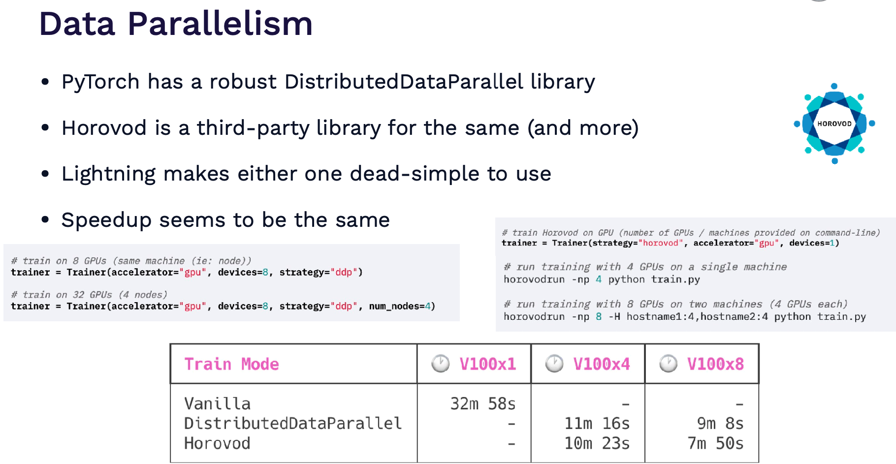

# Lecture 2: Development, Infrastructure and Tooling

## ML-project dream vs reality

- The infrastructure is very large
- This lecture is all about development part (middle part)

## Software engineering
#### Programming language
- `PYTHON`: Because of all the libraries and big community out there!

#### Editors
> FSDL recommends `VSCode`
- Built-in git version control
- Peak documentation
- Open whole project remotely
- Lint code as you write

#### Lineters and Type Hints
- Whatever code style rules you want to follow
- Linters enforce them
- Static type checking both documents code and catches bugs

#### Jupyter Notebooks
- Great as the "first draft"
- Problems:
  - Editor is primitive, no co-pilot
  - Out-of-order execution
  - Hard to version
  - Hard to test
  - Couterpoint:
    - fix all these problems using `nbdev`
> FSDL recommendation: 
> Write code in modules imported into the notebooks ([Sample github repo](https://github.com/full-stack-deep-learning/sample-repo))
> Enables awesome debugging

#### Python environment

> How they setup conda environment: https://github.com/full-stack-deep-learning/conda-piptools

## Deep learning frameworks

- `JAX` is for researchers
- `Pytorch` is for engineers
- `Tensorflow` is for bloomers

#### Pytorch
- Most dominant framework in use (in terms of available models, papers, competition winners)
- Excellent dev. experience
- Production-ready, and even faster with TorchScript
- Great distributed training ecosystem
- Libraries for vision, audio etc
- Mobile deployment is available
- Above all, `Pytorch Lightning`
    - Run on any hardware
    - Performance & bottleneck profiler
    - Model checkpointing
    - Mixed-precision training
- Another possibility: Fast.ai
  - One downside, the coding style is quite different from usual mainstream python 

#### JAX
- General vecorization, auto-differentiation and compilation to GPU/TPU code
- More for research, physics simulations and so-on
- Need separate framework for deep learning (Flax or Haiku)

#### Model zoos
- Pre-trained model architectures available to use

#### ONNX
- Open standard for saving deep learning
- Can do inter-convertibilty

#### Hugging Face
- The most popular model zoo: `60K pre-trained models`
- `7.5K Datatsets`

#### TIMM
- Collection of SOTA computer vision models + related code

## Distributed Training
- [OpenAI blog on techniques for training large neural networks](https://openai.com/blog/techniques-for-training-large-neural-networks/)
  
#### Scenario 1: Data batch and model parameters fit on a single GPU
- This is a case of Trivial parallelism
- Either launch more independent experiments on other GPUs and/or machines
- Or increase batch size until it no longer fits on 1 GPU

#### Scenario 1: Data batch and model parameters fit on a single GPU
- This is a case of `Trivial parallelism`
- Either launch more independent experiments on other GPUs and/or machines
- Or increase batch size until it no longer fits on 1 GPU

#### Scenario 2: Model parameters fit on a single GPU while data batch does not
- This is a case of `Data parallelism`

#### Scenario 3: Model parameters and data batch does not fit on a single GPU
- There are three solutions in this case:

##### Sharded data-parallelism

- Note, optimizer sometimes save a part of it state in 32bit precision even when you are training using mixed-precision
- https://www.microsoft.com/en-us/research/blog/zero-deepspeed-new-system-optimizations-enable-training-models-with-over-100-billion-parameters/

##### Pipelined model-parallelism

##### Tensor-parallelism

- 3D-parallelism uses all three form
- However, the zero-3 performance has improved drastically over the last few months. It might be useful just to use it rather than trying other fancy tricks

#### Even more tricks
- There are things that can improve convergence speed
- For NLP, can use Alibi instead of position encoding and train on shorter sequences, and use sequence length warmup.
- For vision, can use image size warmup, smooth labels, use special optimizer, and more.
- Go through `MosaicML Composer` for more tricks: https://www.mosaicml.com
- There is another package for speedup: [FFCV](https://ffcv.io)

## Why compute matters

#### GPU basics
- Three main factors to consider for GPUs:
  - Amount of data that can fit
  - Speed of crunching through the data on GPU
  - Communication speed b/w GPU and CPU

#### GPU Comparison 

- Benchmarks are available on [lambda labs](https://lambdalabs.com/gpu-benchmarks)
- A100 are the go through server level GPUs

#### Cloud Providers
- Amazon Web Services, Google Cloud Platform, Microsoft Azure are the heavyweights.
- GCP is special because it also has TPU's
- Startups are Lambda Labs, Paperspace, Coreweave, Jarvis and others
- [GPU Cloud Comparison](https://fullstackdeeplearning.com/cloud-gpus/)

#### TPUS
- They are the fastest machine for DL. However, only available on GCP

#### Expensive per-hour does not always imply expensive per-experiment
- https://github.com/full-stack-deep-learning/website/blob/main/docs/cloud-gpus/benchmark-analysis.ipynb
> FSDL recommedation: 
> use the most expensive per-hour GPUs (4x or 8x A100's) in the least-expensive cloud
> The startups are much cheaper than the big boys

#### Selecting a GPU machine
- https://lambdalabs.com/blog/best-gpu-2022-sofar/
- https://timdettmers.com/2020/09/07/which-gpu-for-deep-learning/
> FSDL recommendation:
> Your own GPU machine is worth it just for the mindset shift of maximizing utility vs minimizing cost.
> TPUs are worth experimenting with for large-scale training
> To scale out experiments, use the most expensive per-hour machines in the least expensive cloud.

## Resource Management
- We want to launch an experiment or set of experiments 
- Each experiment needs
    - Machine(s) + GPU(s)
    - Setup (Python+CUDA version, Python requirements)
    - Data
- Solutions
    - Manual
    - SLURM
    - Docker + Kubernetes
    - Software specialized for ML use cases

#### Manual
- Follow best practices for specifying dependencies (e.g. conda + pip-tools)
- Log in to machine, launch experiment
- This works just fine for one machine

#### Slurm
- What if you have a cluster of machines?
- Slurm is an old-school solution to workload management that is still widely used
- A job defines necessary resources, gets queued

#### Docker

#### Kubernetes

#### AWS SageMaker
- Can carry out all steps of ML in this
- However, requires that all steps are done in AWS

- https://sagemaker-examples.readthedocs.io/en/latest/training/distributed_training/pytorch/data_parallel/mnist/pytorch_smdataparallel_mnist_demo.html
- https://github.com/aws-samples/amazon-sagemaker-managed-spot-training/blob/main/pytorch_managed_spot_training_checkpointing/pytorch_managed_spot_training_checkpointing.ipynb

#### Anyscale (makers of Ray, from Berkeley)
- Ray Train is a new project from Ray
- Faster than SageMaker
- Intelligent spot instance support
- Anyscale makes it super simple to provision compute (at a significant markup to AWS)
- Link: https://docs.ray.io/en/latest/train/train.html

#### Other solutions
- Grid.ai
- Determined.ai : Great open-source solution that lets you manage a cluster either on-prem or in the cloud
> FSDL: I feel that a truly simple solution to launching training on many cloud instances still does not exist

## Experiment Management
- Even running one experiment at a time, can lose track of which code, parameters, and dataset generated which trained model
- When running multiple experiments, problem is much worse

#### Tensorboard
- From Google, but not exclusive to Tensorflow
- A fine solution for single experiments
- Gets unwieldy to manage many experiments, and to properly store past work

#### MLflow tracking
- Open-source solution for experiment and model management
- Need to host yourself

#### Weights and Biases
- Really popular, super easy-to-use solution
- Hosted free for public projects
- It is used in this course
- You can log anything
- Make reports and tables
  
#### Hypermeter Optimization
- W&B Sweeps one way to do hyperparameter optimization
- Sagemaker, Determined.ai, Ray etc too has hyperparameter optimization solutions

### All-in-one solutions
- Cover everything from data to training, deployment, everything!
- Amazon Sagemaker
- Gradient from Paperspace
- Domino datalabs (More for non-DL solutions)
